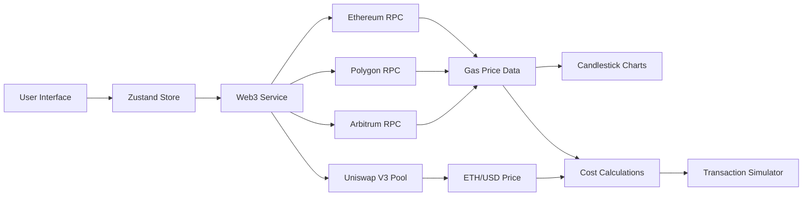

# Cross-Chain Gas Price Tracker

A real-time dashboard that monitors gas prices across Ethereum, Polygon, and Arbitrum networks with wallet simulation capabilities.

## Features

### 🚀 Real-Time Gas Price Monitoring
- **WebSocket Connections**: Live updates from Ethereum, Polygon, and Arbitrum RPC endpoints
- **Multi-Chain Support**: Simultaneous monitoring of three major L1/L2 networks
- **Gas Fee Breakdown**: Base fees, priority fees, and total fees for each chain

### 📊 Interactive Candlestick Charts
- **15-Minute Intervals**: Historical gas price data aggregated into candlestick format
- **Real-Time Updates**: Charts update automatically as new blocks are mined
- **Cross-Chain Comparison**: Visualize gas price volatility across all networks

### 💰 USD Price Integration
- **Uniswap V3 Integration**: Direct parsing of ETH/USDC pool swap events
- **Real-Time Pricing**: Live ETH/USD price calculation without third-party APIs
- **Cost Calculations**: USD cost estimation for gas fees and transactions

### 🎮 Wallet Simulation
- **Transaction Simulation**: Input transaction values to see cross-chain cost comparisons
- **Gas Limit Customization**: Adjustable gas limits for different transaction types
- **Cost Breakdown**: Detailed breakdown of gas costs vs transaction costs

### 🔄 State Management
- **Zustand Store**: Efficient state management with live/simulation mode switching
- **Historical Data**: 24-hour rolling window of gas price data
- **Connection Status**: Real-time connection monitoring for all chains

## Technical Architecture



## Setup Instructions

### Prerequisites
- Node.js 18+ 
- npm or yarn
- Infura API key (for Ethereum WebSocket)

### Installation

1. **Clone the repository**
   ```bash
   git clone <repository-url>
   cd cross-chain-gas-tracker
   ```

2. **Install dependencies**
   ```bash
   npm install
   ```

3. **Configure RPC endpoints**
   
   Edit `lib/web3Service.ts` and replace the RPC endpoints:
   ```typescript
   const RPC_ENDPOINTS = {
     ethereum: 'wss://mainnet.infura.io/ws/v3/YOUR_INFURA_KEY',
     polygon: 'wss://polygon-rpc.com',
     arbitrum: 'wss://arb1.arbitrum.io/ws',
   }
   ```

4. **Start the development server**
   ```bash
   npm run dev
   ```

5. **Open your browser**
   Navigate to `http://localhost:3000`

## Key Components

### Web3Service (`lib/web3Service.ts`)
- Manages WebSocket connections to all three chains
- Handles real-time block monitoring
- Calculates USD prices from Uniswap V3 events
- Implements fallback polling for reliability

### Zustand Store (`lib/store.ts`)
- Centralized state management
- Handles live vs simulation mode switching
- Manages historical data aggregation
- Coordinates cross-component data flow

### GasPriceChart (`components/GasPriceChart.tsx`)
- Lightweight-charts integration
- 15-minute candlestick aggregation
- Real-time chart updates
- Chain-specific styling and data

### TransactionSimulator (`components/TransactionSimulator.tsx`)
- User input handling for transaction simulation
- Cross-chain cost comparison table
- Real-time cost calculations
- Mode switching interface

## Gas Price Calculation

### Ethereum (EIP-1559)
```javascript
totalFee = baseFeePerGas + maxPriorityFeePerGas
```

### Polygon (Legacy)
```javascript
totalFee = gasPrice
```

### Arbitrum (L1 Pricing)
```javascript
totalFee = gasPrice
```

## USD Price Calculation

The application calculates ETH/USD prices directly from Uniswap V3's ETH/USDC pool:

```javascript
price = (sqrtPriceX96**2 * 10**12) / (2**192)
```

## Development

### Project Structure
```
├── app/
│   ├── globals.css
│   ├── layout.tsx
│   └── page.tsx
├── components/
│   ├── GasPriceChart.tsx
│   └── TransactionSimulator.tsx
├── lib/
│   ├── store.ts
│   └── web3Service.ts
├── package.json
└── README.md
```

### Key Dependencies
- **Next.js 14**: React framework with App Router
- **Ethers.js 6**: Web3 library for blockchain interactions
- **Zustand**: Lightweight state management
- **Lightweight Charts**: High-performance financial charts
- **Tailwind CSS**: Utility-first CSS framework

## Troubleshooting

### Connection Issues
- Ensure your Infura API key is valid
- Check network connectivity
- Verify RPC endpoint URLs

### Chart Not Loading
- Check browser console for errors
- Ensure WebSocket connections are established
- Verify data is being received from RPC endpoints

### Simulation Not Working
- Ensure USD price is loaded
- Check that gas price data is available
- Verify transaction value input

## Contributing

1. Fork the repository
2. Create a feature branch
3. Make your changes
4. Add tests if applicable
5. Submit a pull request

## License

MIT License - see LICENSE file for details 